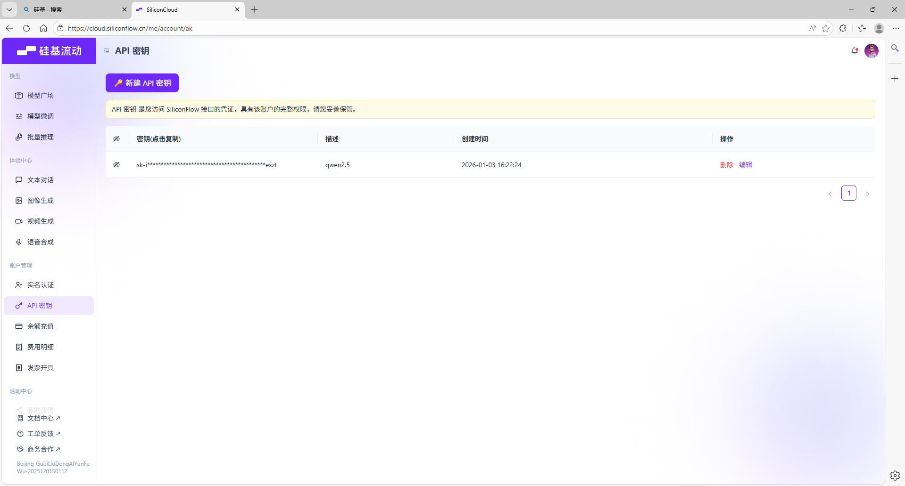
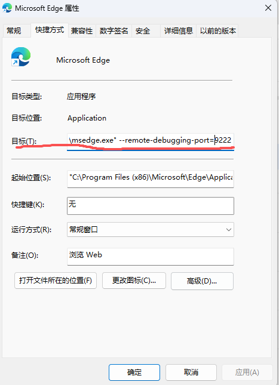

1.api的配置方式

登录硅基流动，注册一个账号，在“API密钥”界面申请一个API即可，软件使用的模型默认是ds的OCR+Qwen2.5 7B,都是免费的，不用担心费用问题

申请好了之后复制到tools/token.env中

2.文件结构的配置方式
在新环境下运行的时候，需要先清空tools/folder_structure，选择文件夹之后使用软件中的新建文件夹方法。

3.浏览器配置方式
在edge的桌面快捷方式上右键进入属性，在目标栏中加上 --remote-debugging-port=9222
注意空格！，如图：

注意，打开浏览器时请从桌面快捷方式打开，如果已经开启了9222端口但是打开浏览器网页转pdf的时候还是报错，请在cmd中运行以下命令
taskkill /F /IM msedge.exe
这将暂停所有edge进程，此时重新从桌面快捷方式打开edge即可。